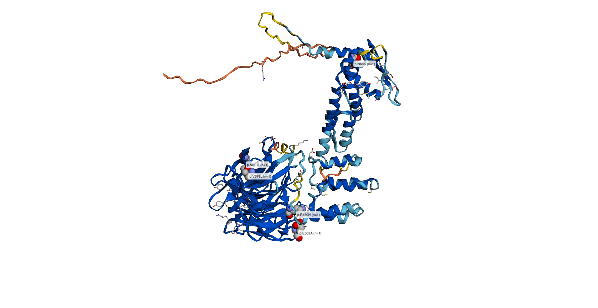

# xsmut3d — somatic mutations on predicted protein structures, across species

`xsmut3d` takes somatic mutation calls for a gene — typically the `annotmuts` table
from [dNdScv](https://github.com/im3sanger/dndscv) — and puts them where selection
actually acts: on the **folded protein**. It fetches the structure from the
[AlphaFold Protein Structure Database](https://alphafold.ebi.ac.uk), annotates every
residue with its functional role and its **modelling confidence**, and reports the
mutations that hit or surround key functional sites.

It is the structural sibling of [`xsmut`](../xsmut), reuses that package's Ensembl /
dNdScv / COSMIC layer, and keeps the same `*_pipeline(gene, mutations, species,
assembly, cosmic, census_path)` call signature.

```
            dNdScv annotmuts (any Ensembl species)
                          │
     ┌────────────────────┴────────────────────┐
     │  xsmut   : onto the human gene model     │  (1D, genomic)
     │  xsmut3d : onto the AlphaFold structure  │  (3D, protein)
     └──────────────────────────────────────────┘
```




---

## What it gives you

| Output | What it answers |
|---|---|
| `res$view` | Rotatable 3D structure; mutations as spheres sized by recurrence, key sites as green sticks, low-confidence regions in the AlphaFold yellow/orange bands |
| `res$plot` | Static multi-track figure: mutation lollipops · human COSMIC · domain architecture · 3D hotspot scan · pLDDT profile — all on one residue axis |
| `res$report` | Every call, ranked, with its domain, nearest functional site **in 3D**, pLDDT band, COSMIC burden at the aligned human residue and AlphaMissense score |
| `res$cluster` | Permutation test: are the mutated residues closer together in 3D than chance? (the thing a lollipop plot cannot tell you) |
| `res$hotspots` | Per-residue 3D neighbourhood burden scan with BH-corrected FDR |
| `res$confidence` | Plain-language statement of which parts of the model you may interpret and which you may not |

---

## Install

```r
# Bioconductor dependencies (sequence alignment)
if (!requireNamespace("BiocManager", quietly = TRUE)) install.packages("BiocManager")
BiocManager::install(c("Biostrings", "pwalign"))

# CRAN dependencies
install.packages(c("httr2", "jsonlite", "data.table", "ggplot2", "patchwork",
                   "memoise", "r3dmol", "htmlwidgets"))

# the companion package, then this one
remotes::install_github("marsangar/xsmut")
remotes::install_github("marsangar/xsmut3d")

# optional: static PNG snapshots of the 3D view
install.packages("webshot2")
```

No account, licence or API key is needed for AlphaFold, UniProt, InterPro or Ensembl.
COSMIC is optional and does require a (free, academic) download — see below.

---

## Quick start

```r
library(xsmut3d)

# muts <- dndscv(mutations, refdb = "Mmul_10.rda")$annotmuts
muts <- data.table::fread(
  system.file("extdata/example_macaque_TP53_annotmuts.tsv", package = "xsmut3d"))

res <- xsmut3d_pipeline(
  gene        = "TP53",
  mutations   = muts,
  species     = "macaque",
  assembly    = "Mmul_10",
  cosmic      = "~/Research/postdoc/projects/AI/xsmut/data/cosmic/Cosmic_MutantCensus_v104_GRCh38.tsv.gz",
  census_path = "~/Research/postdoc/projects/AI/xsmut/data/cosmic/Cosmic_CancerGeneCensus_v103_GRCh38.tsv.gz",
  outdir      = "results/TP53"
)

res                      # one-screen summary
res$view                 # rotate it (RStudio Viewer or a browser)
res$plot                 # ggsave("TP53.pdf", res$plot, width = 11, height = 9.5)
top_hits(res, 10)        # the calls worth looking at first
cat(res$confidence$text) # what you may and may not interpret
```

`cosmic` and `census_path` are optional — drop them and everything except the COSMIC
track still works. With `outdir` set, the pipeline writes the PDF, a standalone
interactive HTML view and two TSVs for you.

### A shareable HTML report

```r
xsmut3d_report(res, "results/TP53/TP53_report.html")
```

One self-contained file: the rotatable structure, the figure, the ranked table and the
modelling caveats. A collaborator needs nothing but a browser.

### Several genes

```r
# load COSMIC once, then reuse it
cos <- xsmut::cosmic_load("…/Cosmic_MutantCensus_v104_GRCh38.tsv.gz",
                          genes = c("TP53", "KRAS", "PTEN", "APC"))

res <- xsmut3d_pipeline(
  gene      = c("TP53", "KRAS", "PTEN", "APC"),
  mutations = muts,
  species   = "macaque", assembly = "Mmul_10",
  cosmic    = cos,
  outdir    = "results"
)

res$KRAS$plot
vapply(res, function(r) r$cluster$p_value, 0)   # 3D clustering per gene
```

Genes that fail (no ortholog, no AlphaFold model) warn and return `NULL` rather than
aborting the run.

---

## Your input table

A dNdScv `annotmuts` data frame is detected automatically and converted; nothing else
is required:

```
sampleID  chr          pos       ref mut gene strand … aachange ntchange   impact    pid
MQD0001d  NC_041754.1  95090953  G   A   TP53 -1       R175H    G524A      Missense  ENSMMUP00000024831
```

The `pid` column is the important one: it is the exact Ensembl protein each call was
annotated against, so `xsmut3d` aligns *that* isoform to the structure instead of
guessing which one you used.

Any other table works too, as long as it has:

| column | required | notes |
|---|---|---|
| `gene` | yes | human symbol; the ortholog is looked up for you |
| `aa_change` *or* `aa_pos` | yes | HGVS protein (`p.R175H`, `p.Q136*`) or an integer position |
| `species_protein_id` | no | Ensembl protein ID; strongly recommended for isoform-exact mapping |
| `consequence` | no | drives the colouring |
| `sample_id` | no | used for per-sample counts |

---

## How a macaque mutation ends up on a structure

Every coordinate hop is explicit and its **percent identity is recorded on the row**,
so a weak mapping is visible rather than silent.

1. **Species** — `"macaque"`, `"Macaca mulatta"` and `"macaca_mulatta"` all resolve via
   `xsmut::ens_resolve_species()`. `assembly = "Mmul_10"` is checked against what
   Ensembl currently serves, and you are warned if they disagree.
2. **Which structure?** `structure_species = "auto"` (default) uses the **query
   species' own** AlphaFold model when one exists — AlphaFold DB covers 48 reference
   proteomes plus all of Swiss-Prot, so macaque, mouse, dog, cow and many others are
   there — and falls back to the **human ortholog's** model otherwise, telling you so.
   Force either with `"query"` or `"human"`.
3. **Placing the calls** — each distinct `pid` is aligned once to the structure's
   UniProt sequence (Needleman–Wunsch, BLOSUM62). `aa_pos` → structure residue number.
   You get `align_identity` per row, a warning below 60%, and `ref_match` telling you
   whether the reference residue in your call actually matches the modelled residue.
4. **Annotation transfer** — a macaque UniProt entry rarely has curated active sites;
   the human entry almost always does. Human UniProt features are walked across the
   ortholog alignment onto the structure's numbering. Transferred features keep
   `transferred = TRUE` and `transfer_identity`, are **drawn with a dashed outline**,
   and are described in the report as hypotheses, not observations.
5. **Reading the structure** — mmCIF is parsed directly (no Bioconductor structure
   packages); pLDDT comes from the B-factor column, burial from a 10 Å neighbour count,
   and the full residue–residue distance matrix drives the 3D tests.

---

## Modelling confidence — please read this part

A predicted structure is not a crystal structure, and `xsmut3d` is built so you cannot
forget that.

**Per residue (pLDDT).** The AlphaFold DB bands are used throughout, with the official
palette:

| band | colour | what it means |
|---|---|---|
| Very high (> 90) | dark blue | backbone *and* side chains reliable |
| Confident (70–90) | light blue | backbone reliable, side chains less so |
| Low (50–70) | yellow | treat with caution; local geometry is a guess |
| Very low (< 50) | orange | **do not interpret**; usually intrinsically disordered |

Every mutation row carries `plddt`, `plddt_band`, `interpretable` (pLDDT ≥
`plddt_threshold`, default 70) and a `confidence_note` in words. Low-confidence calls
are **discounted four-fold in the ranking but never dropped** — you decide.

**Between residues (PAE).** Two residues can each be modelled confidently while their
*relative* placement is not. The predicted aligned error matrix is downloaded and
summarised into `pae_global` per residue; a residue that is locally confident but
poorly placed relative to the rest of the chain is flagged, because "these two
mutations are 6 Å apart" is not a safe statement for such a pair.

**In the statistics.** `cluster_test_3d()` and `hotspots_3d()` exclude residues below
the pLDDT threshold from *both* the observed set and the null, and report how many were
excluded. Including disordered tails inflates both tests.

**In the figure and the view.** The pLDDT profile is a panel of the static figure,
shaded by band. In the 3D view, `colour_by = "plddt"` (the default) paints the cartoon
in the AlphaFold bands, so anything below 70 is unmistakably yellow/orange; in the other
colourings those residues get a pale wash.


```r
res$confidence$text                       # the one-paragraph summary
res$confidence$segments                   # confident / low-confidence stretches
subset(res$report, !interpretable)        # calls you should not over-read
res$model$plddt_fractions                 # whole-model summary
```

---

## Finding the biology

### Key functional sites, including in 3D

```r
subset(res$report, !is.na(site_hit) | !is.na(site_near))
```

- `site_hit` — the call lands exactly on an annotated active site, binding site,
  metal/DNA-contact residue, disulfide or modified residue.
- `site_near` / `site_near_dist` — the call is within 8 Å of one **in space** while
  being far away in sequence. This is the class of hit a lollipop plot structurally
  cannot show, and it is where a lot of comparative signal lives.
- `domain` — the UniProt/InterPro domain(s) containing the residue.

### 3D clustering

```r
res$cluster       # global test
head(res$hotspots)  # per-residue scan, BH-corrected
```

The global test compares the recurrence-weighted mean pairwise distance between mutated
residues against permutations over all confidently modelled residues. A small `p_value`
with a negative `z` means the mutations are tighter in space than chance — convergent
functional targeting rather than scattered passengers.

### Cross-species comparison with human cancer

Supply `cosmic` and each mutated residue also carries `cosmic_samples_at_residue`: how
many human tumours carry a mutation at the **aligned human residue**. A macaque
mutation at a position that is a human COSMIC hotspot is a very different observation
from one that is not.

### AlphaMissense

Where AlphaFold serves AlphaMissense scores for the entry, missense calls get
`am_pathogenicity` (0–1) and `am_class`. These are predictions about *human* germline
missense variants — useful as a prior for a conserved residue, not as evidence about
somatic selection in your species.

---

## COSMIC data (optional)

COSMIC has no public API; files are downloaded free for academic use from
<https://cancer.sanger.ac.uk/cosmic/download>. `xsmut3d` reads them through
`xsmut::cosmic_load()`, which normalises both the current and legacy formats:

| purpose | current file | legacy |
|---|---|---|
| mutations | `Cosmic_MutantCensus_v*_GRCh38.tsv.gz` | `CosmicMutantExport.tsv` |
| gene census | `Cosmic_CancerGeneCensus_v*_GRCh38.tsv.gz` | `cancer_gene_census.csv` |

Match `human_assembly` to your download (`"GRCh38"` default, or `"GRCh37"`).

---

## Caching

Models, PAE matrices and AlphaMissense tables are cached on disk, so a second run of
the same gene is offline and instant.

```r
xsmut3d_cache_dir()                       # where things are kept
Sys.setenv(XSMUT3D_CACHE = "~/af_cache")  # or put it somewhere you control
```

API responses are additionally memoised for the session. Ensembl rate-limits at about
15 requests/second; the clients retry politely.

---

## Doing it step by step

The pipeline is a thin wrapper — every stage is a documented function you can call
yourself, inspect and substitute:

```r
sp     <- xsmut::ens_resolve_species("macaque")
target <- resolve_structure_target("TP53", sp, structure_species = "auto")
model  <- af_model(target$accession)                 # AlphaFold entry + PAE + AlphaMissense
struct <- read_structure(model)                      # residues, pLDDT, distances, burial
dom    <- domain_table(target$accession, target$human_accession)   # with human transfer

mapped <- map_mutations_to_structure(muts, "TP53", model, species = sp)
mapped <- annotate_confidence(mapped, struct, pae = model$pae)
res_ct <- collapse_by_residue(mapped)

cluster_test_3d(res_ct, struct)
hot <- hotspots_3d(res_ct, struct, radius = 10)

plot_structure_tracks(struct, res_ct, dom, hotspots = hot)
view_structure_3d(struct, res_ct, dom, colour_by = "domain")
```

Useful on their own:

```r
residues_near(struct, 175, radius = 8)     # what sits around a residue in space
key_sites(dom)                             # every annotated single-residue feature
confidence_segments(struct)                # confident vs low-confidence stretches
pae_profile(model$pae)                     # local vs global placement confidence
save_view_png(res$view, "TP53.png")        # static snapshot (needs webshot2)
```

---

## Repository layout

```
R/utils.R        HTTP + cache, alignment helpers, residue maps
R/uniprot.R      accession resolution (Ensembl xref → UniProt search), features, InterPro
R/alphafold.R    AlphaFold DB API, model/PAE/AlphaMissense download, pLDDT bands
R/structure.R    mmCIF/PDB parsing, residue table, distances, burial
R/domains.R      domain table, human→species annotation transfer, functional flagging
R/map3d.R        structure target resolution, calls → residue numbering, COSMIC on structure
R/confidence.R   pLDDT/PAE bookkeeping, interpretability flags, plain-language summary
R/cluster3d.R    global 3D clustering test + per-residue hotspot scan
R/view3d.R       interactive r3dmol view
R/plot2d.R       static multi-track figure
R/pipeline.R     xsmut3d_pipeline(), top_hits()
R/report.R       self-contained HTML report
tests/           offline unit tests; network tests behind XSMUT3D_NETWORK_TESTS=true
```

```r
# run the offline tests
testthat::test_local()
# include the ones that hit AlphaFold / UniProt
Sys.setenv(XSMUT3D_NETWORK_TESTS = "true"); testthat::test_local()
```

---

## Known limits

- AlphaFold models are **monomers**. Interface residues of an obligate dimer (TP53, for
  instance) are not in contact with their partner here, so an interface hotspot can look
  solvent-exposed. Use `burial` as a within-monomer measure only.
- Models beyond ~2700 residues are split into fragments; `af_model(fragment = n)` picks
  one, and residue numbering is offset accordingly. Whole-protein 3D statistics on such
  proteins are per-fragment.
- Residue numbering is **UniProt**, not Ensembl or RefSeq. When your transcript differs
  from the UniProt canonical, the alignment handles it, but check `ref_match` before
  quoting a residue number in a figure legend.
- Burial is a Cβ-neighbour-count proxy, not a solvent-accessible surface area.
- Transferred annotation inherits any error in the ortholog alignment. Check
  `transfer_identity` before leaning on a transferred active site in a distant species.
- Nonsense, frameshift and splice calls are placed at their first affected codon; a
  truncation does not of course affect only that residue.
